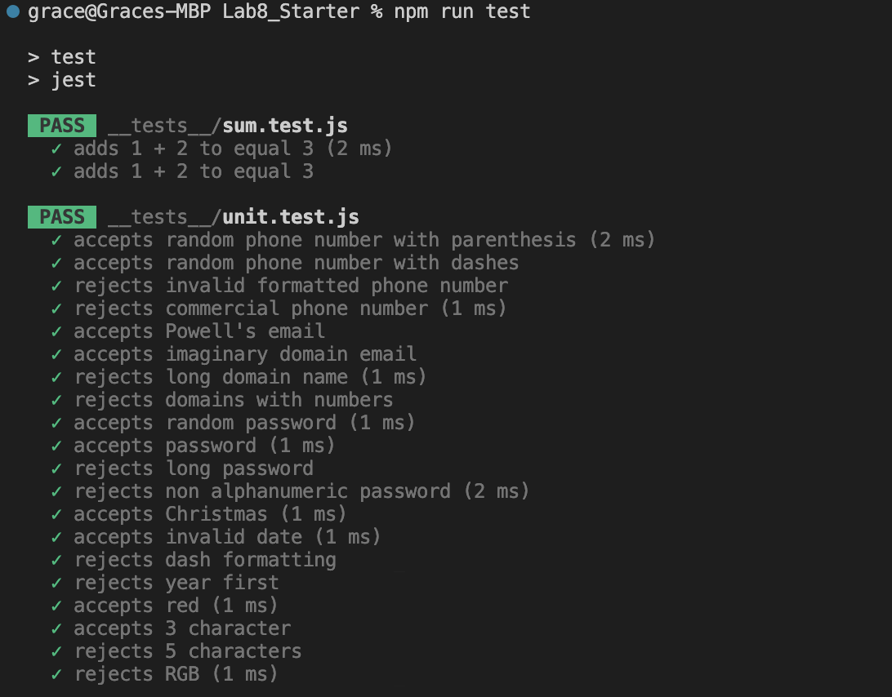
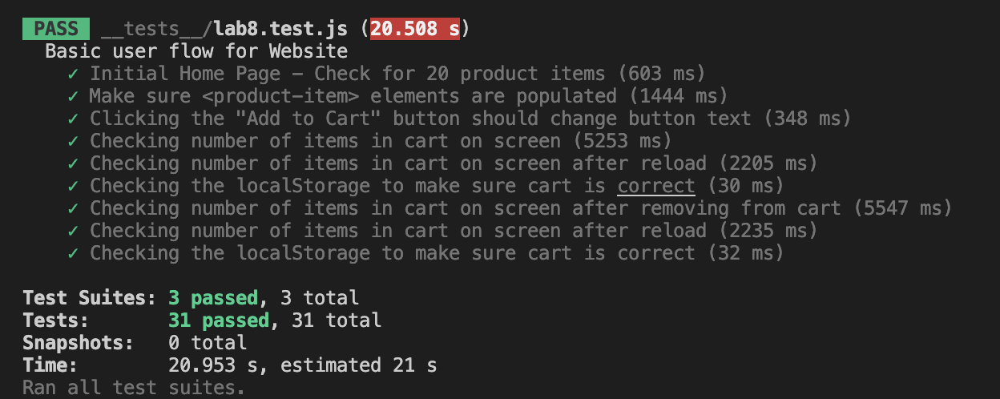

# Lab 8 - Starter

Grace Yang

1. Within a Github action that runs whenever code is pushed. This is because we want to make sure that code added to the repository works. We want to use a Github action to make sure that this code works not just because of local dependencies but across all machines as well. 
2. No.
3. No. This feature involves a lot of different components that need to be tested both on the messenger side and receiver side. There can be a lot of moving parts including a backend service and various UI choices. 
4. Yes. This is a small scale encapsulated units that does not have many moving parts. 

---

